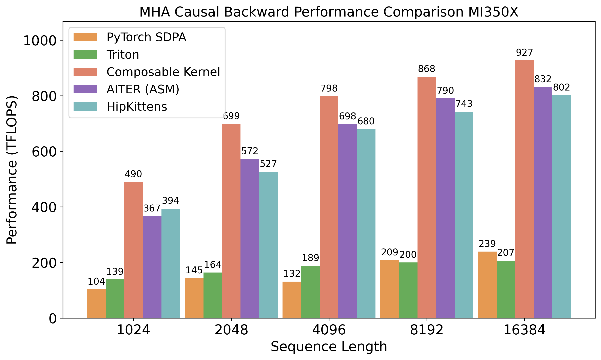
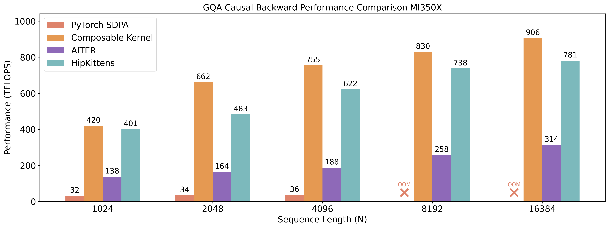
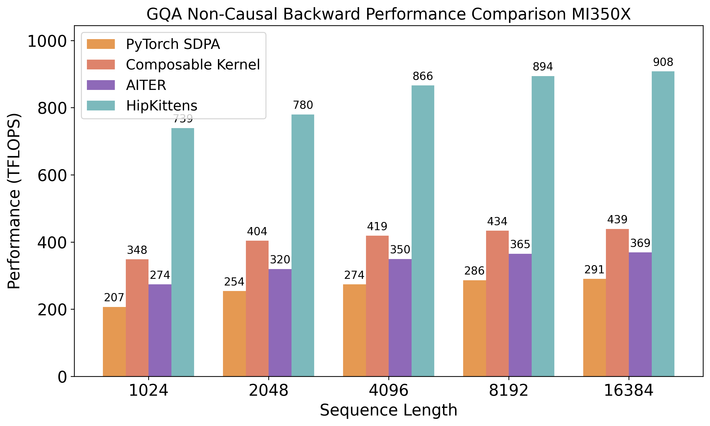
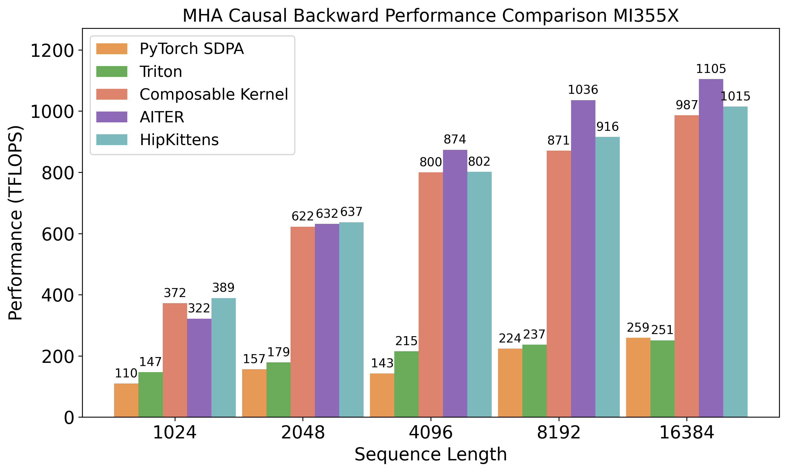
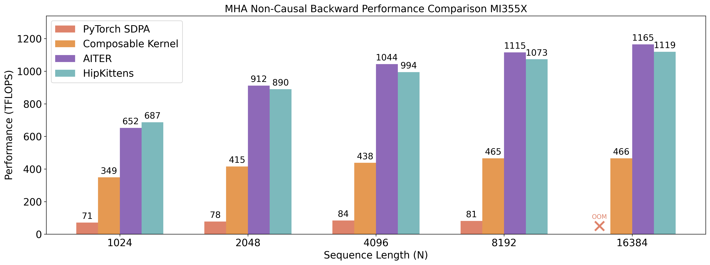
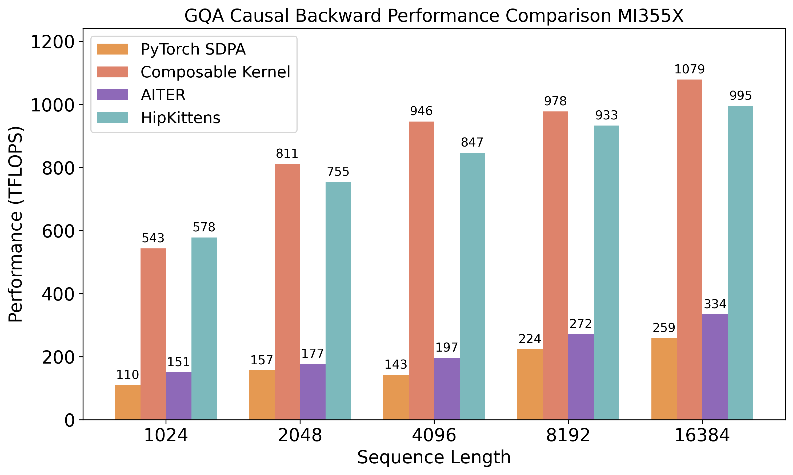
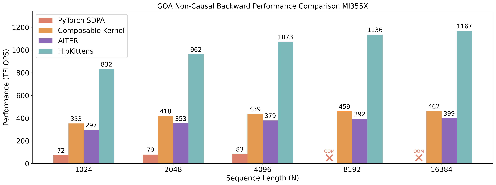

# Attention Backwards Performance Comparison

## MI350X

### MHA (B=16, H=16, D=128)

#### Causal

    

#### Non-Causal

    

### GQA (B=16, Q_HEADS=64, KV_HEADS=8, D=128)

#### Causal

    

#### Non-Causal

    

---

## MI355X

### MHA (B=16, H=16, D=128)

#### Causal

    

#### Non-Causal

    

### GQA (B=16, Q_HEADS=64, KV_HEADS=8, D=128)

#### Causal

    

#### Non-Causal

    

