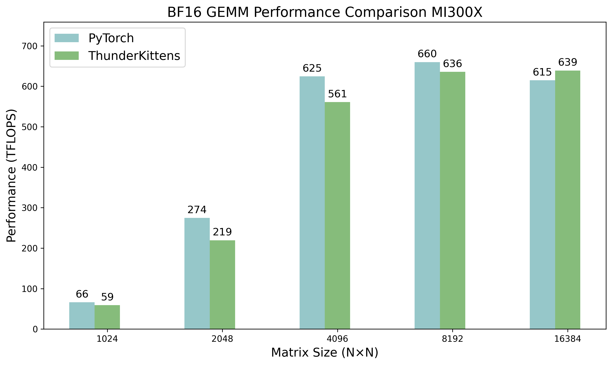
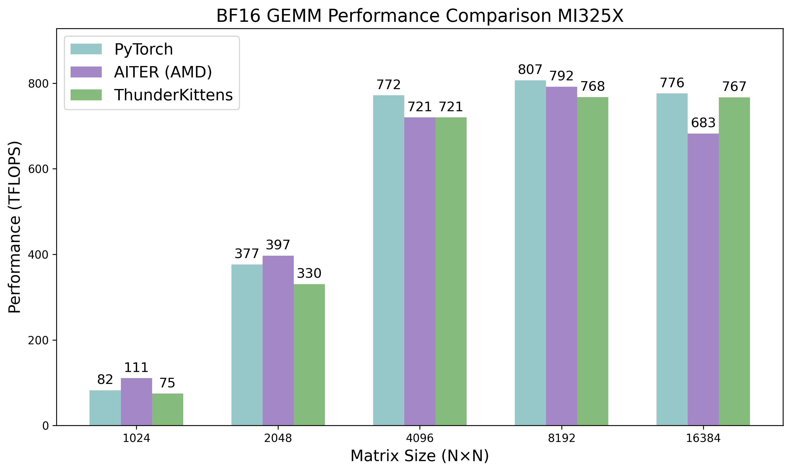
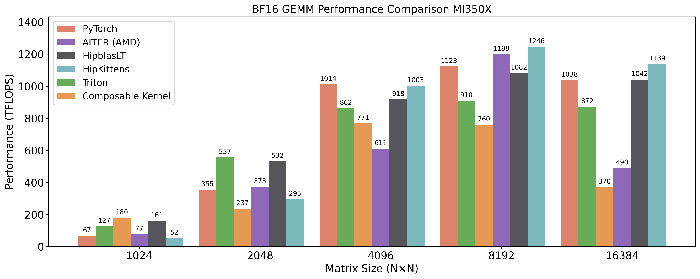

## Current results

### BF16 GEMM

Mi300x:
<div align="center" >
    
</div>


Mi325x:
<div align="center" >
     
</div>

Mi350x:
<div align="center" >
     
</div>


Mi355x:
<div align="center" >
    
</div>


### Baselines

Benchmark using:
```bash
./benchmark.sh
```

You can view the benchmarking protocol in ```test_python.py```.

We consider the following baselines:

- HipblasLT: Within the docker ``rocm/7.0-preview:rocm7.0_preview_pytorch_training_mi35X_alpha``:
```bash
hipblaslt-bench --batch_count 1 --a_type bf16_r --b_type bf16_r --c_type f32_r --d_type f32_r --rotating 512 --iters 1000 --cold_iters 200 -m 8192 -n 8192 -k 8192
```

- PyTorch

- AITER: AMD's library of high performance kernels
```
from aiter.tuned_gemm import tgemm
```

